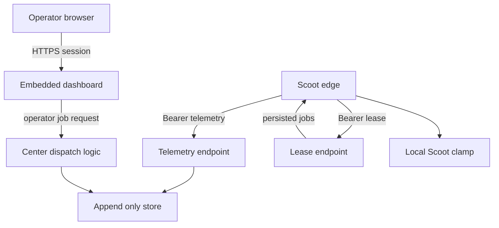

# Scootship E2 Dispatch Threat Model

**English** | [简体中文](dispatch-threat-model.zh-CN.md)

This threat model covers the EDGE.md E2 job-dispatch surface. Center-side queue, lease, idempotency,
lifecycle, and operator-facing dispatch **creation** code now exist and are covered below. This
document is a gate artifact for that creation surface, not blanket authorization for future
dispatch work: the separate **control** surface (cancel/retry/edit of an already-queued job) is
out of scope here and needs its own threat-model note before it is built.

## Executive summary

The highest-risk E2 themes are authority expansion, queue abuse, forged capability or node identity,
replay / duplicate job execution, and loss of dispatch provenance. The center must never become a
remote shell or policy-control plane; dispatch must remain schema'd goal data, authenticated per
node, clamped below the node's local ceiling, idempotent, capacity-bounded, and auditable end to end.

## Scope and assumptions

In scope:

- `GET /jobs/lease?node=&capacity=` dispatch semantics in `internal/center`.
- Queue, direct-node routing, lifecycle, and dispatch-provenance storage used by E2.
- Existing node auth, telemetry ingest, audit retention, health signals, and dashboard/operator
  auth that E2 will rely on.

Out of scope:

- Authorizing operator-facing dispatch rollout by this document alone.
- Changing Scoot's `docs/EDGE.md` or depending on Scoot internals.
- Multi-tenant SaaS, billing, public internet productization, reverse-dialing, or remote shell.

Assumptions confirmed for the creation surface covered by this document:

- Deployment remains private/VPC-style, not a public multi-tenant SaaS.
- Dashboard operators are trusted humans, but operator accounts can be compromised and must be
  treated as a real threat source.
- Node descriptors and capability claims are advisory, not authority.
- Real Scoot edge enforces an unattended readonly clamp and rejects any policy above the local
  ceiling before running a job. Scoot has shipped the clamp as `scoot --unattended -e "<goal>"`
  and, as of `scoot-edge v0.8.0`, `edge.job_root` cwd confinement for dispatched jobs. The named
  compatible contract version for this document is `scoot-edge >= v0.8.0`.

Assumptions that still require confirmation before the separate dispatch **control** surface
(cancel/retry/edit) is built:

- An operator surface that can affect an already-running or queued job (not just create a new one)
  needs its own review of authorization, audit, and rollback semantics.

Open questions:

- Should per-operator or per-source-IP rate limiting be added on top of the per-node
  `SCOOTSHIP_DISPATCH_QUEUE_LIMIT` cap, beyond the existing dashboard login lockout?
- Should dispatch provenance carry an explicit token fingerprint (which credential authenticated
  the edge that eventually leases/runs the job) and a goal fingerprint (hash) for tamper-evident
  audit, separate from the raw `goal` text? (Deferred; see TM-002/TM-008.)
- What does the design and threat model look like for dispatch **control** (cancel/retry/edit of an
  already-queued job)? This is unbuilt and out of scope for this document.
- Should E2 creation be extended to label/capability fan-out (dispatch to every node matching
  criteria) beyond today's single manually-selected node, and if so, what confirmation step does a
  broad fan-out need?
- What audit retention and backup requirements apply to center dispatch provenance?

## System model

### Primary components

- Operators use the embedded dashboard after form login and HttpOnly session auth (`internal/center/auth.go`, `internal/web`).
- Edge nodes authenticate to node routes with per-node bearer tokens (`internal/center/server.go`, `internal/center/auth.go`, `internal/tokens`).
- `/telemetry` ingests append-only status, audit batches, and job lifecycle events (`internal/center/telemetry.go`, `internal/store`).
- `/jobs/lease` is an authenticated, node-bound dispatch endpoint that returns only persisted jobs
  for the authenticated node (`internal/center/lease.go`).
- The wire schema defines and validates `JobBody` and `JobEventBody`; lifecycle telemetry updates
  persisted dispatch records (`internal/protocol/protocol.go`, `internal/center/telemetry.go`,
  `internal/store`).

### Data flows and trust boundaries

- Operator browser -> dashboard: credentials, sessions, and job requests over HTTPS; protected by login session, HttpOnly cookie, lockout, and security headers.
- Dashboard -> center dispatch logic: operator-submitted goal, target node, requested policy,
  deadline, retries, and required labels/tools/skills; authorized by the `dispatch:manage`
  capability, CSRF-protected, server-side validated, and audited (requestor + job_id logged) before
  entering the queue.
- Edge -> center `/telemetry`: bearer token, status, audit batches, and `job_event`; authenticated per node and validated before store mutation.
- Edge -> center `/jobs/lease`: bearer token, node ID, capacity; authenticated today and must remain node-bound when jobs are returned.
- Center -> append-only store: telemetry, dispatch provenance, and job lifecycle state; must persist before acknowledgement where cursor or idempotency semantics depend on durability.

#### Diagram

## Assets and security objectives

| Asset | Why it matters | Security objective |
| --- | --- | --- |
| Node bearer tokens | Authenticate edge nodes to telemetry and lease endpoints | C/I |
| Operator sessions and accounts | Dispatch authority starts from dashboard access | C/I |
| Job queue and idempotency keys | Decide what work is offered to nodes and whether it repeats | I/A |
| Node local policy ceiling | Prevents center from expanding local execution authority | I |
| Audit batches and dispatch provenance | Evidence for what ran, why, who requested it, and result | C/I |
| Append-only store and backups | Recovery source for telemetry, operators, tokens, and dispatch trace | C/I/A |

## Attacker model

### Capabilities

- Remote attacker can reach center endpoints exposed by deployment.
- Attacker may obtain or guess a node token if operator handling is weak.
- Attacker may compromise a dashboard operator account.
- A malicious or compromised node can lie about descriptor, capability, health, and lifecycle data.
- Network intermediaries may exist when TLS is terminated by a trusted proxy.

### Non-capabilities

- Attacker cannot force the center to reverse-dial an edge because no such path should exist.
- Attacker cannot safely assume Scoot local policy can be raised by the center; this must remain node-local.
- Attacker cannot execute arbitrary shell through a valid E2 design; jobs are schema'd `kind=run` goal data.

## Entry points and attack surfaces

| Surface | How reached | Trust boundary | Notes | Evidence |
| --- | --- | --- | --- | --- |
| Dashboard login | Browser form POST | Operator -> center | Session issuance and brute-force lockout | `internal/center/auth.go`, `internal/loginguard` |
| Dispatch creation UI | Authenticated dashboard, `dispatch:manage` capability | Operator -> queue | `/dispatch/new` (GET) and `POST /dispatch` are capability-gated, CSRF-protected, and per-node queue-bounded; `/dispatch` and `/api/dispatch` stay read-only | `internal/center/dispatch_create.go`, `internal/store` |
| `/telemetry` | Edge HTTP POST | Edge -> center | Parses NDJSON and validates bodies before mutation | `internal/center/telemetry.go` |
| `/jobs/lease` | Edge HTTP GET | Edge -> center | Node-token auth, node binding, capacity bound, persisted job lease | `internal/center/lease.go` |
| Token lifecycle UI/API | Authenticated dashboard | Operator -> node auth registry | Creates, rotates, revokes center-managed tokens | `internal/center/tokens.go`, `internal/tokens` |
| Append-only store | Server process | Center -> disk | Stores telemetry and dispatch evidence | `internal/store` |

## Top abuse paths

1. Compromised operator account creates a high-risk goal, routes it broadly, and tries to hide provenance.
2. Stolen node token leases jobs for another node unless node binding remains enforced.
3. Malicious node advertises false capabilities to attract jobs it should not receive.
4. Network or client retry replays a lease or job acknowledgement and causes duplicate execution.
5. Queue flood or high capacity claims starve legitimate nodes or overload the center.
6. Dispatch implementation accidentally turns goal data into shell/eval.
7. Center requests a policy above the node ceiling and real edge fails to clamp it.
8. Job lifecycle events are accepted without durable provenance, breaking post-incident reconstruction.

## Threat model table

| Threat ID | Threat source | Prerequisites | Threat action | Impact | Impacted assets | Existing controls | Gaps | Recommended mitigations | Detection ideas | Likelihood | Impact severity | Priority |
| --- | --- | --- | --- | --- | --- | --- | --- | --- | --- | --- | --- | --- |
| TM-001 | Compromised operator | Operator holds `dispatch:manage` and a valid session | Submit a harmful goal against a reachable node | Unauthorized node-targeted action, up to the node's own ceiling | Operator accounts, job queue, audit | Login/session/lockout, session-bound CSRF, `dispatch:manage` capability gate (separate from `fleet:view`), a per-node pending-queue cap, and requestor+job_id logging all exist; creation is node-targeted only, no fan-out surface exists to abuse | No per-operator dispatch rate limit or anomaly alerting yet; goal/token fingerprint not yet separated fields in provenance | Add dispatch-specific rate limiting/alerting on top of login lockout; add goal/token fingerprint to provenance (TM-002/TM-008) | Alert on bulk dispatch and policy changes | Medium | High | High |
| TM-002 | Stolen node token | Token leaked from env/file/operator handling | Lease jobs or post lifecycle as a node | Job theft, fake state, audit confusion | Node tokens, job queue, provenance | Per-node bearer token, node mismatch checks, and node-bound lease exist | Token fingerprint is not yet attached to dispatch provenance | Keep jobs bound to authenticated node, rotate/revoke tokens, record token fingerprint used | Alert on token use from new IP or impossible node changes | Medium | High | High |
| TM-003 | Malicious node | Node can report descriptor/capability | Advertise false capability to receive jobs | Misrouting and unsafe execution attempt | Node descriptors, policy ceiling | Roadmap says descriptors advisory and local ceiling gates execution | No capability verification semantics yet | Treat descriptors as routing hints only; require allowlisted labels or operator assignment for sensitive jobs | Surface descriptor drift and unexpected capability changes | Medium | Medium | Medium |
| TM-004 | Network/client retry | E2 long-poll and lifecycle retry exist | Replay job lease or lifecycle messages | Duplicate execution or wrong terminal state | Job idempotency, queue state | Persisted `idem_key` de-duplication and terminal-state protection exist | Explicit retry scheduling remains future work | Keep duplicate lease/event idempotent; add retry-window tests when retry scheduling lands | Metrics for duplicate idem keys and late event | Medium | High | High |
| TM-005 | Remote attacker or compromised operator | Center endpoint reachable, or operator session held | Flood lease/telemetry, claim large capacity, or create dispatch jobs faster than they drain | DoS or queue starvation | Center availability, queue fairness | Request timeouts, telemetry body cap, max lease capacity, a configurable per-node pending-dispatch-job cap (`SCOOTSHIP_DISPATCH_QUEUE_LIMIT`, `ErrDispatchQueueFull`), and dashboard login lockout all exist | No dedicated per-IP/per-operator rate limit on `POST /dispatch` itself beyond login lockout and the per-node queue cap | Add an explicit per-operator or per-IP dispatch-creation rate limit if abuse is observed | Rate, queue depth, timeout, and rejection metrics; alert when a node's queue sits at its cap | Medium | Medium | Medium |
| TM-006 | Implementation bug | Developer expands dispatch path | Convert goal to shell/eval or raw command | Remote command execution | Node execution boundary | Hard rules prohibit raw commands; protocol validates closed `kind=run`; tests cover job lease bodies | No static dispatch grep/audit rule yet | Keep closed `kind=run`, no shell fields, tests proving raw command path absent | Static grep/audit rule for shell/eval in dispatch paths | Low | High | High |
| TM-007 | Contract mismatch | Operator or center runs against an edge older than the confining release | Center dispatches assuming cwd confinement that an old edge does not enforce | Data over-read via a readonly job on an unconfined edge | Local policy ceiling, node safety | Scoot has shipped `edge.job_root` cwd confinement in `scoot-edge v0.8.0`; the compatible version is named in `docs/roadmap.md` and this document | The center has no runtime check of which `scoot-edge` version/build is actually connecting; an operator could still point an old edge at a current center | Document the required minimum edge version prominently in deployment docs; consider a future `edge_version` compatibility warning surfaced on the node/fleet view | `edge_version` drift already exists as a health signal; consider a specific low-version warning | Low | Medium | Medium |
| TM-008 | Store/provenance gap | Job lifecycle stored without dispatch context | Incident responders cannot prove who/what/why | Audit integrity | Dispatch provenance, audit trail | Append-only dispatch snapshots include requestor, node, policy, idem key, lifecycle, and session linkage | Goal fingerprint and token fingerprint are not yet separated fields | Add explicit fingerprints and lifecycle-without-dispatch detection | Alert on lifecycle without matching dispatch record | Medium | Medium | Medium |

## Criticality calibration

- Critical: pre-auth or token-only path that enables raw command execution, raising node policy ceiling, or unaudited fleet-wide dispatch.
- High: compromised operator or token can dispatch harmful work, duplicate execution can occur, or Scoot clamp mismatch can bypass local policy.
- Medium: capability spoofing, queue starvation, lifecycle poisoning, or partial provenance loss with existing auth boundaries intact.
- Low: confusing UI copy, low-sensitivity metadata exposure, or noisy failures that do not affect dispatch authority.

## Focus paths for security review

| Path | Why it matters | Related Threat IDs |
| --- | --- | --- |
| `internal/center/lease.go` | Lease response path must remain node-bound and capacity-bounded | TM-002, TM-004 |
| `internal/protocol/protocol.go` | Job and job-event schemas define what authority can cross the wire | TM-006, TM-007 |
| `internal/center/auth.go` | Operator sessions gate dispatch authority | TM-001 |
| `internal/tokens` | Node token lifecycle controls token theft recovery | TM-002 |
| `internal/store` | Queue/provenance durability, idempotency, and the per-node queue cap belong here or behind a new focused interface | TM-004, TM-005, TM-008 |
| `internal/mockedge` | E2 tests must not turn mock edge into a second Scoot implementation | TM-003, TM-007 |
| `docs/roadmap.md` | Boundary gate and hard non-goals prevent unsafe partial dispatch | TM-006, TM-007 |

## Quality check

- Entry points discovered here cover dashboard login, dispatch creation UI, telemetry, lease, token lifecycle, and storage.
- Each trust boundary appears in at least one abuse path or threat row.
- Runtime behavior is separated from CI/release; CI is not modeled as an E2 runtime authority path.
- The separate dispatch **control** surface (cancel/retry/edit) stays explicitly out of scope and unbuilt until it gets its own threat-model note.
- This document is a gate artifact for dispatch **creation**, not approval for the still-unbuilt **control** surface.
