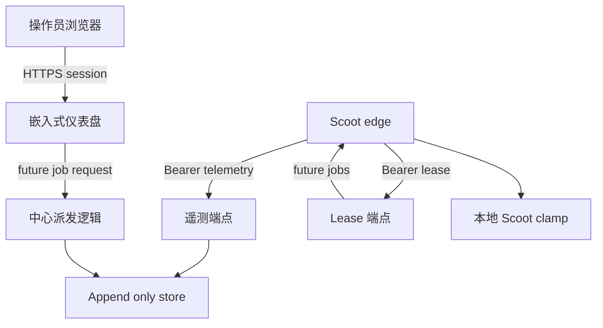

# Scootship E2 派发威胁模型

[English](dispatch-threat-model.md) | **简体中文**

这是面向未来 EDGE.md E2 作业派发表面的前置威胁模型。它本身不授权实现或上线。只有在下方假设被确认、Scoot 发布兼容的无人值守 readonly clamp、且 Scootship 增加派发专属代码和测试之后，E2 才能继续。

## 执行摘要

E2 的最高风险主题是权力扩大、队列滥用、能力或节点身份伪造、重放 / 重复执行，以及派发溯源丢失。中心绝不能变成远程 shell 或节点策略控制面；派发必须始终是 schema 化的 goal 数据、每节点鉴权、低于节点本地上限、幂等、容量有界，并且端到端可审计。

## 范围与假设

范围内：

- 未来 `GET /jobs/lease?node=&capacity=` 派发语义。
- E2 所需的队列、路由、生命周期和派发溯源存储。
- E2 将依赖的现有节点鉴权、遥测摄入、审计保留、健康信号和仪表盘 / 操作员鉴权。

范围外：

- 本文档不实现派发。
- 不修改 Scoot 的 `docs/EDGE.md`，也不依赖 Scoot 内部实现。
- 不做多租户 SaaS、计费、公网产品化、反向拨号或远程 shell。

E2 写代码前需要 owner 确认的假设：

- 部署仍是私有 / VPC 风格，而不是公网多租户 SaaS。
- 仪表盘操作员是可信人类，但操作员账户可能被攻陷，必须作为真实威胁源处理。
- 节点 descriptor 和 capability 声明只是建议性路由信号，不是权限来源。
- 真实 Scoot edge 会在运行作业前强制无人值守 readonly clamp，并拒绝高于本地上限的策略。

开放问题：

- 哪一个 `scoot-edge` 契约版本会包含无人值守 readonly clamp？
- E2 初期是否应先限制为人工选择节点，而不是立刻支持标签 / 能力 fan-out？
- 中心派发溯源适用哪些审计保留和备份要求？

## 系统模型

### 主要组件

- 操作员经表单登录和 HttpOnly 会话使用嵌入式仪表盘（`internal/center/auth.go`、`internal/web`）。
- 边缘节点用每节点 bearer token 访问节点路由（`internal/center/server.go`、`internal/center/auth.go`、`internal/tokens`）。
- `/telemetry` 摄入 append-only 的 status、audit_batch 和未来 job lifecycle events（`internal/center/telemetry.go`、`internal/store`）。
- `/jobs/lease` 目前是已鉴权但空派发的占位（`internal/center/lease.go`）。
- 线缆 schema 已定义 `JobBody` 和 `JobEventBody`，但真实 E2 语义尚未实现（`internal/protocol/protocol.go`）。

### 数据流与信任边界

- 操作员浏览器 -> 仪表盘：凭据、会话和未来 job 请求经 HTTPS；受登录会话、HttpOnly cookie、锁定机制和安全头保护。
- 仪表盘 -> 中心派发逻辑：未来 goal 与路由条件；进入队列前必须授权、schema 校验并审计。
- 边缘 -> 中心 `/telemetry`：bearer token、status、audit_batch 和未来 `job_event`；按节点鉴权，修改 store 前校验。
- 边缘 -> 中心 `/jobs/lease`：bearer token、node ID、capacity；当前已鉴权，未来返回 job 时仍必须绑定节点。
- 中心 -> append-only store：遥测、未来派发溯源和作业生命周期；凡游标或幂等语义依赖持久性的地方，必须先持久化再 ack。

#### 图

## 资产与安全目标

| 资产 | 为什么重要 | 安全目标 |
| --- | --- | --- |
| 节点 bearer tokens | 认证边缘节点访问 telemetry 和 lease 端点 | C/I |
| 操作员会话与账户 | 未来派发权力从仪表盘访问开始 | C/I |
| 作业队列与幂等键 | 决定哪些工作被提供给节点以及是否重复执行 | I/A |
| 节点本地策略上限 | 防止中心扩大本地执行权力 | I |
| 审计批次与派发溯源 | 证明运行了什么、为什么、谁请求、结果如何 | C/I |
| Append-only store 与备份 | 遥测、操作员、token 和未来派发链路的恢复来源 | C/I/A |

## 攻击者模型

### 能力

- 远程攻击者可能触达部署暴露的中心端点。
- 如果运维处理不当，攻击者可能获得节点 token。
- 攻击者可能攻陷仪表盘操作员账户。
- 恶意或失陷节点可以伪造 descriptor、capability、health 和 lifecycle 数据。
- 可信反代终止 TLS 时，网络中间层可能存在。

### 非能力

- 攻击者不能让中心反向拨号到边缘，因为这条路径不应存在。
- 攻击者不能假设中心能抬高 Scoot 本地策略；这个边界必须留在节点本地。
- 合格 E2 设计不能通过线缆执行任意 shell；job 只能是 schema 化的 `kind=run` goal 数据。

## 入口点与攻击面

| 表面 | 如何触达 | 信任边界 | 说明 | 证据 |
| --- | --- | --- | --- | --- |
| 仪表盘登录 | 浏览器表单 POST | 操作员 -> 中心 | 会话签发和暴力破解锁定 | `internal/center/auth.go`、`internal/loginguard` |
| 未来派发 UI/API | 已登录仪表盘 | 操作员 -> 队列 | 必须显式、授权、可审计 | E2 未实现；门禁见 `docs/roadmap.zh-CN.md` |
| `/telemetry` | 边缘 HTTP POST | 边缘 -> 中心 | 解析 NDJSON 并在修改状态前校验 | `internal/center/telemetry.go` |
| `/jobs/lease` | 边缘 HTTP GET | 边缘 -> 中心 | 当前为空派发占位，使用节点 token 鉴权 | `internal/center/lease.go` |
| token 生命周期 UI/API | 已登录仪表盘 | 操作员 -> 节点鉴权注册表 | 创建、轮换、撤销中心托管 token | `internal/center/tokens.go`、`internal/tokens` |
| Append-only store | 服务进程 | 中心 -> 磁盘 | 存储遥测和未来派发证据 | `internal/store` |

## 主要滥用路径

1. 被攻陷的操作员账户提交高风险 goal，大范围派发，并试图隐藏溯源。
2. 泄露的节点 token 领取其他节点的 job，除非节点绑定持续强制。
3. 恶意节点伪造 capability，诱导中心派发不应分配给它的 job。
4. 网络或客户端重试重放 lease 或 job ack，导致重复执行。
5. 队列洪泛或夸大 capacity 使合法节点饥饿，或拖垮中心。
6. 派发实现错误地把 goal 数据转换成 shell/eval。
7. 中心请求高于节点天花板的策略，且真实 edge 没有 clamp。
8. job lifecycle event 没有匹配的派发溯源，导致事后无法还原。

## 威胁模型表

| ID | 威胁源 | 前置条件 | 动作 | 影响 | 受影响资产 | 现有控制 | 缺口 | 建议缓解 | 检测思路 | 可能性 | 影响 | 优先级 |
| --- | --- | --- | --- | --- | --- | --- | --- | --- | --- | --- | --- | --- |
| TM-001 | 被攻陷操作员 | E2 派发 UI/API 存在 | 提交或 fan-out 有害 goal | 未授权车队动作 | 操作员账户、队列、审计 | 已有登录、会话、锁定；E2 门禁阻塞派发 | 尚无 E2 授权模型 | 增加显式 action authz、广域 fan-out 确认、不可变溯源 | bulk dispatch 和策略变化告警 | 中 | 高 | 高 |
| TM-002 | 被盗节点 token | token 泄露 | 作为节点领取 job 或伪造 lifecycle | job 被窃取、状态伪造、审计混乱 | 节点 token、队列、溯源 | 每节点 token 和 node mismatch 校验已有 | E2 lease 返回语义未构建 | job 绑定 authenticated node；支持轮换 / 撤销；记录 token fingerprint | 新 IP 或异常节点变更告警 | 中 | 高 | 高 |
| TM-003 | 恶意节点 | 节点能上报 descriptor/capability | 伪造能力吸引 job | 错误路由或不安全执行尝试 | descriptor、策略上限 | 路线图限定 descriptor 只是建议，本地 ceiling gate 执行 | 能力校验语义未定义 | descriptor 仅作 hint；敏感 job 需 allowlist label 或人工分配 | capability drift 告警 | 中 | 中 | 中 |
| TM-004 | 网络 / 客户端重试 | E2 long-poll 和生命周期重试存在 | 重放 lease 或 lifecycle | 重复执行或终态错误 | 幂等键、队列状态 | 协议已有 `idem_key` 字段；E2 未实现 | 缺 durable idempotency 表 | 按 `idem_key` 持久化 job 状态；重复 lease/event 幂等处理 | duplicate idem key 和 late event 指标 | 中 | 高 | 高 |
| TM-005 | 远程攻击者 | 中心端点可达 | 洪泛 lease/telemetry 或夸大 capacity | DoS 或队列饥饿 | 中心可用性、队列公平性 | 已有请求超时和 telemetry body cap | E2 队列 / capacity 限制未建 | 限制 capacity、按 node/token/IP 限流、限制队列大小和 lease timeout | rate、queue depth、timeout 指标 | 中 | 中 | 中 |
| TM-006 | 实现缺陷 | 开发者扩展 dispatch path | 把 goal 转成 shell/eval 或原始命令 | 远程命令执行 | 节点执行边界 | 铁律禁止 raw command；协议把 `goal` 建模为数据 | 尚无 E2 代码可审 | 保持闭合 `kind=run`，不加 shell 字段，测试证明 raw command path 不存在 | dispatch 路径 shell/eval grep/audit 规则 | 低 | 高 | 高 |
| TM-007 | 契约不匹配 | Scoot clamp 未发布或版本未命名 | 中心假设节点会 clamp，但实际没有 | 策略天花板绕过 | 本地策略上限、节点安全 | E2 门禁要求兼容 Scoot clamp | 外部依赖未满足 | 未命名兼容版本前阻塞 E2；加入兼容测试 | 契约版本未知时启动警告或 readiness fail | 中 | 高 | 高 |
| TM-008 | 存储 / 溯源缺口 | lifecycle 没有派发上下文 | 无法证明谁、什么、为什么 | 审计完整性受损 | 派发溯源、审计链 | telemetry append-only store 已有 | 派发溯源 schema 缺失 | 持久化请求人、goal fingerprint、effective policy、node、时间、idem key、session 链接 | 无匹配 dispatch record 的 lifecycle 告警 | 中 | 中 | 中 |

## 严重度校准

- Critical：预鉴权或仅凭 token 即可原始命令执行、抬高节点策略上限，或未审计的全队派发。
- High：被攻陷操作员或 token 可以派发有害工作，出现重复执行，或 Scoot clamp 契约不匹配导致本地策略绕过。
- Medium：capability 伪造、队列饥饿、lifecycle 污染或在现有鉴权边界下的局部溯源丢失。
- Low：文案误导、低敏元数据暴露，或不影响派发权力的噪声失败。

## 安全复审重点路径

| 路径 | 为什么重要 | 相关威胁 |
| --- | --- | --- |
| `internal/center/lease.go` | 未来 lease 返回路径必须保持节点绑定，且在 E2 门禁前继续为空 | TM-002, TM-004 |
| `internal/protocol/protocol.go` | Job / job-event schema 定义哪些权力能过线缆 | TM-006, TM-007 |
| `internal/center/auth.go` | 操作员会话将门控未来派发权力 | TM-001 |
| `internal/tokens` | 节点 token 生命周期决定 token 泄露后的恢复能力 | TM-002 |
| `internal/store` | 未来队列 / 溯源持久化与幂等应在这里或新聚焦接口后面实现 | TM-004, TM-008 |
| `internal/mockedge` | E2 测试不能把 mock edge 变成第二个 Scoot 实现 | TM-003, TM-007 |
| `docs/roadmap.zh-CN.md` | 边界门禁与非目标阻止不安全的局部派发 | TM-006, TM-007 |

## 质量检查

- 已覆盖入口点：仪表盘登录、未来派发 UI/API、telemetry、lease、token 生命周期和存储。
- 每个信任边界至少出现在一个滥用路径或威胁行中。
- 已区分运行时与 CI/release；CI 不被建模为 E2 运行时权力路径。
- 假设仍显式保留，因为本文档尚未记录 owner 确认。
- 本文档是门禁材料，不是实现批准。
